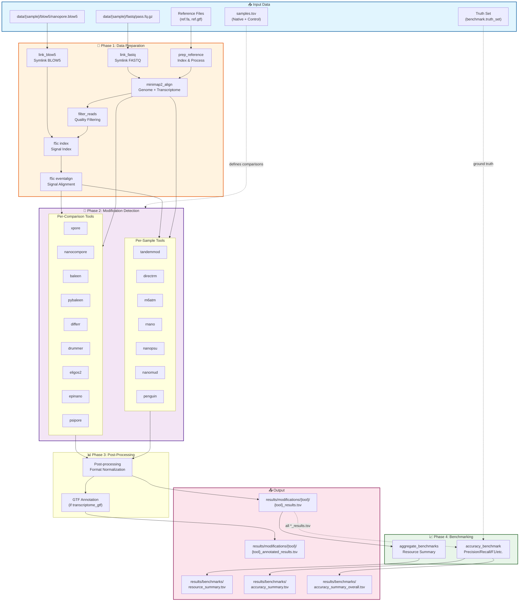
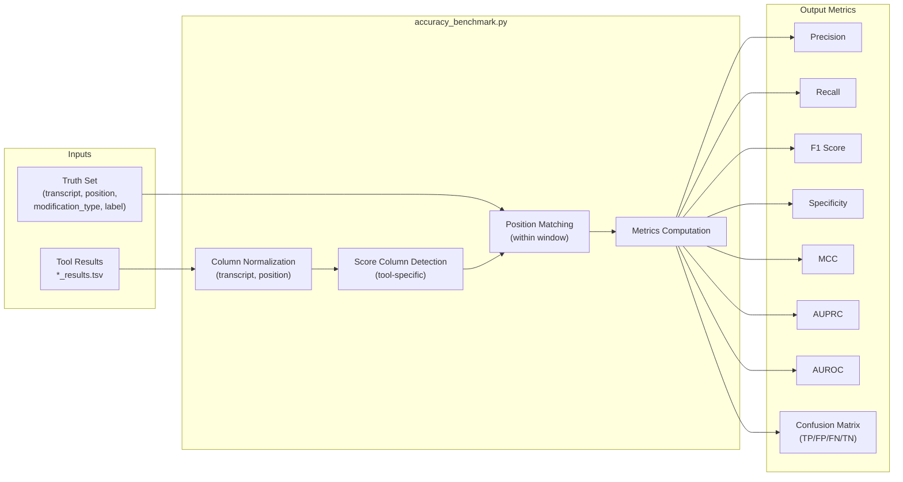
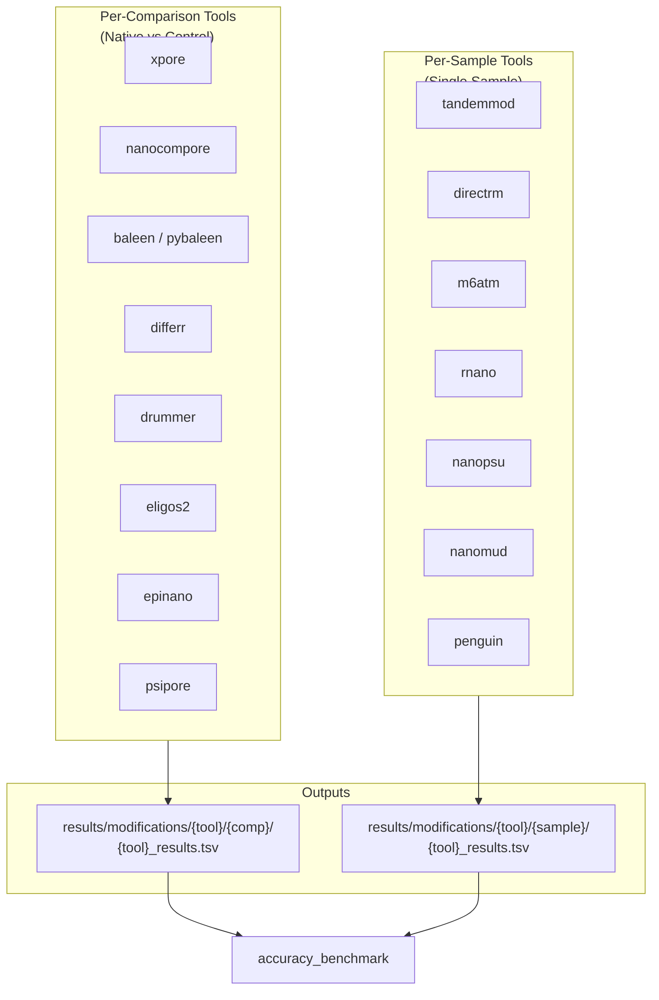
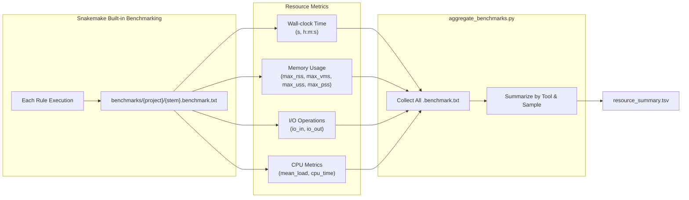

# NanoRNAMod Benchmarking Module Flowchart

## 1. Overall Workflow Architecture



## 2. Benchmarking Module Detail



## 3. Tool Categories & Data Flow



## 4. Resource Benchmarking Flow



---

## 5. Visualization Design Recommendations

### 5.1 Recommended Tools

| Tool | Purpose | Reason |
|------|---------|--------|
| **Matplotlib + Seaborn** | Static charts | Python-native, integrates with workflow |
| **Plotly** | Interactive charts | Hover tooltips, zoom, export |
| **MultiQC** | QC aggregation | Already in bioinformatics ecosystem |
| **Vega-Lite / Altair** | Declarative viz | JSON export, Jupyter integration |

### 5.2 Color Palette

```
Primary Tools:
- xpore:        #1f77b4 (blue)
- nanocompore:  #ff7f0e (orange)
- baleen:       #2ca02c (green)
- pybaleen:     #17becf (cyan)
- differr:      #d62728 (red)
- drummer:      #9467bd (purple)
- eligos2:      #8c564b (brown)
- epinano:      #e377c2 (pink)

Metric Categories:
- Accuracy:     #2196f3 (blue)
- Performance:  #4caf50 (green)
- Resource:     #ff9800 (orange)
- Quality:      #9c27b0 (purple)
```

### 5.3 Suggested Visualizations

#### A. Accuracy Comparison Dashboard

```
┌─────────────────────────────────────────────────────────────┐
│  F1 Score by Tool (Bar Chart)                               │
│  ┌──────────────────────────────────────────────────────┐   │
│  │ ████████████████████████████  xpore (0.85)           │   │
│  │ ██████████████████████  nanocompore (0.78)           │   │
│  │ ███████████████████  baleen (0.72)                   │   │
│  └──────────────────────────────────────────────────────┘   │
├─────────────────────────────────────────────────────────────┤
│  Precision vs Recall (Scatter Plot)                         │
│  ┌──────────────────────────────────────────────────────┐   │
│  │      R                                                │   │
│  │      e    ● xpore                                     │   │
│  │      c       ● nano                                   │   │
│  │      a          ● baleen                              │   │
│  │      l    ● pybaleen                                  │   │
│  │             Precision →                               │   │
│  └──────────────────────────────────────────────────────┘   │
└─────────────────────────────────────────────────────────────┘
```

#### B. Resource Usage Heatmap

```
                    Runtime (h)    Memory (GB)    CPU (%)
    xpore           [███░░░] 2.1   [██████] 8.2   [████░] 75%
    nanocompore     [████░░] 3.5   [█████░] 6.5   [█████] 85%
    baleen          [██░░░░] 1.2   [██░░░░] 3.1   [██░░░] 45%
    pybaleen        [██░░░░] 1.0   [█░░░░░] 2.0   [███░░] 55%
```

#### C. ROC/PR Curves (Per Tool)

```python
# Pseudo-code for generating ROC curves
for tool in tools:
    fpr, tpr, thresholds = roc_curve(y_true, y_scores[tool])
    plt.plot(fpr, tpr, label=f'{tool} (AUC = {auroc[tool]:.2f})')
```

### 5.4 Output File Structure

```
results/benchmarks/
├── accuracy_summary.tsv           # Per modification_type metrics
├── accuracy_summary_overall.tsv   # Aggregated metrics
├── resource_summary.tsv           # Runtime & memory usage
├── plots/
│   ├── f1_comparison.png          # Bar chart
│   ├── precision_recall.png       # Scatter plot
│   ├── roc_curves.png             # Multi-line plot
│   ├── resource_heatmap.png       # Resource comparison
│   └── per_tool/
│       ├── xpore_roc.png
│       ├── xpore_pr.png
│       └── ...
└── interactive/
    └── benchmark_dashboard.html   # Plotly dashboard
```

---

## 6. Implementation Notes

### 6.1 Key Dependencies

- `sklearn.metrics` for AUROC/AUPRC computation
- `pandas` for data manipulation
- `matplotlib`/`seaborn` for static plots
- `plotly` for interactive dashboards (optional)

### 6.2 Configuration

```yaml
# config/config.yaml
benchmark:
  truth_set: "path/to/truth_set.tsv"
  window: [0, 5, 10]  # Multi-window evaluation

  visualization:
    generate_plots: true
    interactive: true
    output_format: ["png", "html"]
```

### 6.3 Future Enhancements

1. **Bootstrap confidence intervals** for metric uncertainty
2. **Stratified analysis** by transcript region (5'UTR, CDS, 3'UTR)
3. **Per-modification-type breakdown** (m6A vs Psi vs m1A)
4. **Sample size sensitivity** analysis
5. **Tool consensus** visualization (Venn diagrams, upset plots)
